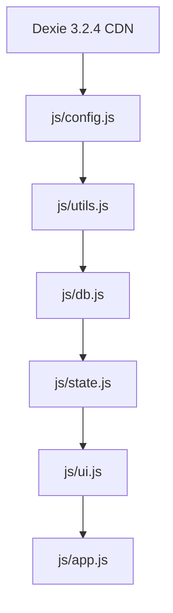
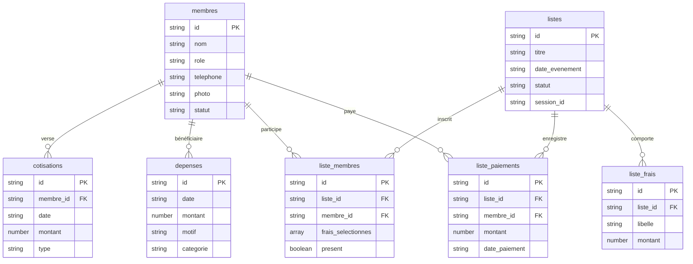

# Architecture Technique — M3D Gestion

## 1. Vision et Principes Directeurs

**M3D Gestion** est une Progressive Web App (PWA) conçue pour la gestion administrative, financière et événementielle de l'association paroissiale de jeunesse **M3D**.

### Principes Clés
1. **Zéro dépendance de build (No-Build / Vanilla Web Standards)** : Aucun transpileur (Babel), bundler (Webpack, Vite) ou framework (React, Vue) n'est requis. Le projet s'exécute directement dans n'importe quel navigateur moderne ou serveur statique.
2. **Offline-First & Résilience locale** : L'intégralité des données est stockée sur l'appareil de l'utilisateur via **IndexedDB** (piloté par Dexie.js 3.2.4). L'application reste 100% opérationnelle sans aucune connexion Internet.
3. **Souveraineté des données** : Pas de backend distant obligatoire. Les données appartiennent à l'utilisateur, avec export/import JSON intégral et sauvegarde chiffrable/protégée.
4. **Design System Mobile-First Responsive** : Interface soignée, typographie `Inter`, tokens CSS centralisés et adaptation dynamique pour smartphones, tablettes, desktop (>900px) et impression papier (`@media print`).

---

## 2. Cartographie Globale des Composants

```text
M3D/
├── index.html                   # Point d'entrée unique (HTML5 sémantique, scripts ordonnés)
├── manifest.webmanifest         # Manifest PWA (icônes, standalone, thèmes)
├── sw.js                        # Service Worker v17 (Cache First, Stale-While-Revalidate)
│
├── css/
│   ├── style.css                # Point d'entrée CSS unifié (bundle via @import)
│   ├── variables.css            # Design System (tokens de couleurs, rayons, typographie)
│   ├── base.css                 # Reset, styles génériques, utilitaires et animations
│   ├── layout.css               # Structure globale (Topbar, Conteneur #app, Tabbar, FAB)
│   ├── components.css           # Composants UI (Cartes, KPI, Tableaux, Badges, Modales)
│   └── responsive.css           # Adaptations grand écran (>900px), impression, legacy Safari
│
├── js/
│   ├── config.js                # Constantes de domaine, statuts, types, icônes SVG
│   ├── utils.js                 # Fonctions utilitaires pures (sécurité XSS, dates, formatage)
│   ├── db.js                    # Couche d'accès aux données IndexedDB via Dexie v6
│   ├── state.js                 # Gestion de l'état applicatif (thème, session, verrouillage)
│   ├── ui.js                    # Contrôleurs d'interface partagés (modales, sheets, toasts)
│   └── app.js                   # Contrôleur applicatif principal, routage par onglet, vues
│
├── icons/
│   ├── icon-192.png             # Icône PWA 192x192
│   └── icon-512.png             # Icône PWA 512x512
│
└── docs/
    ├── ARCHITECTURE.md          # Le présent document
    ├── DEVELOPMENT.md           # Guide pour développeurs et contributeurs
    └── CHANGELOG.md             # Journal chronologique des évolutions
```

---

## 3. Ordre de Chargement et Dépendances JavaScript

Les scripts JavaScript sont chargés séquentiellement dans `index.html` pour garantir l'absence de références circulaires ou de dépendances non résolues :



### Responsabilités par Module :

| Module | Rôle & Contenu | Dépendances |
| :--- | :--- | :--- |
| **`config.js`** | Déclaration des constantes métier immuables (`COULEURS_ROLES`, `ICONES_SVG`, `TYPES_EVENEMENT_LABELS`, `VALEURS_DEFAUT`, clés de stockage). | Aucune |
| **`utils.js`** | Fonctions utilitaires sans effets de bord : `esc()` (sanitisation XSS), `fmt()` (monnaie), `fmtDate()` (dates FR), `genererIdMembre()`, compression d'image JPEG via Canvas, téléchargement de fichiers. | `config.js` |
| **`db.js`** | Schéma de base de données Dexie (v1 à v6), migrations automatiques, méthodes de lecture/écriture métier (`chargerDonneesDimanche`, `calculerBalanceMembre`, gestion des activités). | Dexie, `config.js`, `utils.js` |
| **`state.js`** | État global de session en mémoire : session pastorale active (`Session 2026-2027`), thème (clair/sombre), timer de verrouillage automatique (30 min d'inactivité). | `config.js` |
| **`ui.js`** | Composants d'interface interactifs : `openSheet`, `closeSheet`, `toast()`, boîtes de dialogue avec mot de passe `confirmWithPassword()` avec support de la touche Entrée. | `utils.js`, `config.js` |
| **`app.js`** | Orchestrateur applicatif : routage par onglets (`accueil`, `membres`, `dimanche`, `dettes`, `plus`), gestionnaires d'événements, synchronisation globale, export/import de sauvegardes. | Tous les modules ci-dessus |

---

## 4. Modèle de Données et Persistance (IndexedDB / Dexie)

La base de données locale porte le nom `m3d_db`. Son schéma a évolué jusqu'à la version 6 pour supporter l'historique financier et les activités multi-frais :



### Tables Gérées :
- `membres` : Annuaire des jeunes, contact, fonction, photo compressée, date de naissance.
- `cotisations` : Versements hebdomadaires de 200 FCFA pour les dimanches.
- `depenses` : Sorties de caisse justifiées (achats, collations, secours).
- `evenements` : Calendrier annuel et thèmes.
- `presences` : Registre de pointage dominical.
- `config` : Préférences locales (mot de passe caisse, session, devise).
- `listes` : Activités et sorties (retraites, camps, agapes).
- `liste_frais` : Frais multiples modulaires attachés à une activité.
- `liste_membres` : Inscriptions des participants avec choix des frais.
- `liste_paiements` : Historique inaltérable des encaissements par participant.

---

## 5. Architecture CSS et Design System

Le style est découpé selon une méthodologie modulaire inspirée de ITCSS (Inverted Triangle CSS) :

1. **`variables.css`** : Tokens de design (palette Indigo 50-900, surfaces sombres `#0F172A`, rayons de bordure, ombres portées, durées de transition).
2. **`base.css`** : Reset CSS moderne, styles de base (`box-sizing`, polices, titres, barres de défilement).
3. **`layout.css`** : Grille maîtresse `#app`, `header.topbar`, `nav.tabbar` fixe avec pastille "bump" sur l'onglet actif, Floating Action Button (`.fab`).
4. **`components.css`** : Composants métier atomiques (cartes `.card`, indicateurs `.kpi`, tableaux défilables, badges d'état, bottom-sheets modales, formulaires accessibles).
5. **`responsive.css`** : Règles d'adaptation grand écran (menu latéral transformé, conteneurs centrés à 900px max, support des encoches iOS `safe-area-inset`, styles d'impression papier propres).

---

## 6. Sécurité Frontend

1. **Prévention des Injections XSS** :
   - Toute donnée textuelle issue de l'utilisateur ou de la base locale passe par `esc()` avant interpolation HTML :
   ```javascript
   function esc(valeur) {
     return String(valeur ?? "")
       .replace(/&/g, "&amp;")
       .replace(/</g, "&lt;")
       .replace(/>/g, "&gt;")
       .replace(/"/g, "&quot;")
       .replace(/'/g, "&#039;");
   }
   ```
   - Les valeurs d'attributs de style dynamiques (couleurs des rôles) sont validées via `safeColor()` contre une liste blanche ou une expression régulière stricte hexadécimale.
2. **Protection de la Caisse par Mot de Passe** :
   - Les actions sensibles (suppression d'historique, réinitialisation de session, imports écrasants) nécessitent la validation du mot de passe administrateur via `confirmWithPassword()`.
   - Verrouillage automatique de session après 30 minutes d'inactivité.
3. **Sanitisation des Médias** :
   - Les photos de membres sont décodées, redimensionnées à 320px max et ré-encodées en JPEG compressé (qualité 0.7) côté client via `<canvas>`, neutralisant tout exploit binaire ou charge malveillante.

---

## 7. Cycle de Vie PWA et Service Worker

- **Stratégie Cache First (Stale While Revalidate)** : L'application répond instantanément depuis le cache local du navigateur (`m3d-cache-v17`).
- **Mise à jour en arrière-plan** : Lorsqu'un accès réseau est détecté, les fichiers mis à jour sont téléchargés silencieusement et appliqués au cycle suivant (`skipWaiting` + `clients.claim`).
- **Compatibilité Multi-Plateformes** : Prise en charge des métadonnées `apple-mobile-web-app-*` pour les terminaux iOS/iPadOS plus anciens, en complément du `manifest.webmanifest`.
