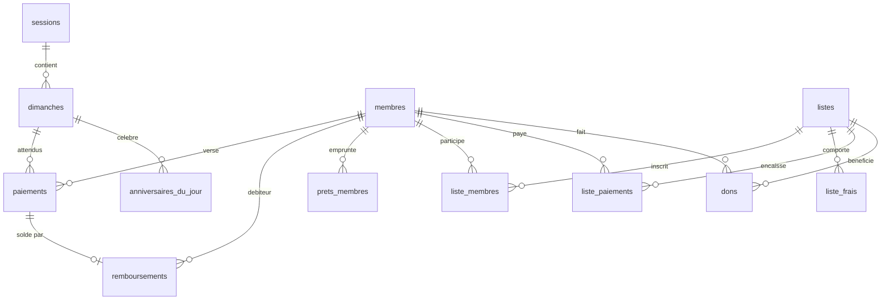

# Architecture Technique — M3D Gestion

> Réécrit en v1.9.0. La version précédente décrivait un schéma v6, un service
> worker v17, et cinq tables (`cotisations`, `depenses`, `presences`,
> `evenements`, `config`) qui n'existent plus depuis longtemps.

**Version décrite :** 1.9.0 — schéma IndexedDB v9, service worker v39

---

## 1. Vision et Principes Directeurs

**M3D Gestion** est une Progressive Web App (PWA) conçue pour la gestion
administrative, financière, événementielle et pastorale de l'association
paroissiale de jeunesse **M3D**.

### Principes Clés

1. **Zéro dépendance de build** : aucun transpileur, bundler ni framework. Le
   projet s'exécute directement dans un navigateur ou derrière n'importe quel
   serveur statique.
2. **Offline-First** : la totalité des données vit sur l'appareil, via
   **IndexedDB** (piloté par Dexie.js 3.2.4). L'application reste opérationnelle
   sans connexion.
3. **Souveraineté des données** : pas de backend. Sauvegarde et restauration
   par export/import JSON.
4. **Event Sourcing** : aucun total n'est stocké. Les soldes sont recalculés
   depuis l'historique des paiements à chaque lecture.
5. **Design System mobile-first** : tokens CSS centralisés, adaptation
   smartphone / tablette / desktop (>900px) / impression.

---

## 2. Cartographie des Composants

```text
M3D/
├── index.html                   # Point d'entrée unique, scripts ordonnés
├── manifest.webmanifest         # Manifest PWA
├── sw.js                        # Service Worker v39
├── VERSION                      # Version applicative (1.9.0)
│
├── css/
│   ├── style.css                # Point d'entrée (@import)
│   ├── variables.css            # Design tokens
│   ├── base.css                 # Reset, typographie, animations
│   ├── layout.css               # Topbar, #app, tabbar, FAB
│   ├── components.css           # Cartes, KPI, tableaux, badges, sheets
│   └── responsive.css           # >900px, print, anciens navigateurs
│
├── js/
│   ├── config.js         (164)  # Constantes de domaine
│   ├── utils.js          (404)  # Fonctions pures, échappement XSS, formats
│   ├── db.js            (2170)  # Couche données — SEUL fichier autorisé à toucher IndexedDB
│   ├── state.js          (176)  # État global (thème, session, onglet)
│   ├── ui.js             (226)  # Sheets, toasts, confirmation mot de passe
│   ├── app.js           (1092)  # Orchestration, routage, modales transverses
│   │
│   ├── modules/
│   │   ├── accueil.js     (97)  # Tableau de bord
│   │   ├── membres.js    (174)  # Annuaire
│   │   ├── cotisations.js(102)  # Feuilles de collecte dominicales
│   │   ├── finances.js   (486)  # Caisse, dettes, prêts entre membres
│   │   ├── activites.js  (951)  # Activités, frais, calendrier
│   │   ├── dons.js       (404)  # Dons
│   │   ├── recherche.js  (116)  # Recherche globale
│   │   ├── graphiques.js (275)  # Graphiques Canvas
│   │   ├── exports.js    (277)  # Points d'entrée des exports
│   │   └── systeme.js    (490)  # Paramètres, sauvegarde/restauration
│   │
│   └── services/
│       └── pdf/
│           ├── socle.js      (187)  # Feuille de style, en-tête, pied, impression
│           ├── composants.js ( 80)  # Tableaux, résumés, listes
│           └── rapports.js   (452)  # Les 5 rapports
│
├── tools/                      # Harnais de test Node (aucune dépendance npm)
│   ├── verify-globals.js       # 118 identifiants globaux attendus
│   ├── test-dettes.js          # 26 assertions
│   ├── test-donnees-test.js    # 29 assertions
│   ├── test-logique.js         # 22 assertions
│   └── test-pdf.js             # 34 assertions
│
├── icons/
│   ├── icon-192.png
│   └── icon-512.png
│
└── docs/
    ├── ARCHITECTURE.md         # Le présent document
    ├── DEVELOPMENT.md          # Guide développeur
    └── CHANGELOG.md
```

**Total : 8 323 lignes de JavaScript réparties sur 19 fichiers de production.**

`app.js` faisait 3 657 lignes avant la v1.9.0. Le découpage par domaine a
été livré ; le détail est dans [REFACTORING_REPORT.md](../REFACTORING_REPORT.md).

**Routage des onglets** — la barre de navigation est écrite directement dans
`index.html` (boutons `.tab` avec `data-tab`), et `showTab(tab)` dans
`app.js` aiguille sur cinq écrans : `accueil`, `membres`, `dimanche`,
`finance`, `activites`. `dons`, `cotisations` et `calendrier` sont des
sous-écrans, accessibles depuis `activites` ou `finance` via un bouton retour.

> ⚠️ `TABS` dans `config.js` annonce encore l'ancienne barre
> (`accueil, membres, dimanche, dettes, plus`) alors que l'interface en compte
> cinq autres. Cette constante est **du code mort** : elle n'est référencée
> nulle part. La navigation réelle est pilotée par le HTML. À supprimer, ou à
> remplacer par une source de vérité unique — mais pas les deux, sinon elles
> divergeront à nouveau.

---

## 3. Ordre de Chargement et Dépendances

Les scripts sont chargés séquentiellement dans `index.html`. Il n'y a pas de
modules ES : tout est dans le scope global, et l'ordre détermine ce qui est
résolvable au chargement.

```text
Dexie 3.2.4 (CDN)
  → config.js
  → utils.js
  → db.js
  → state.js
  → ui.js
  → modules/accueil.js
  → modules/membres.js
  → modules/cotisations.js
  → modules/finances.js
  → modules/activites.js
  → modules/dons.js
  → modules/recherche.js
  → modules/graphiques.js
  → modules/exports.js
  → services/pdf/socle.js        ← après exports.js
  → services/pdf/composants.js
  → services/pdf/rapports.js
  → modules/systeme.js
  → app.js
```

### La seule dépendance d'ordre qui compte

`exports.js` **précède** `services/pdf/socle.js`, parce que le socle appelle
`openPrintableWindow()`, définie dans `exports.js`. Inverser les deux ne
provoquerait pas d'erreur — l'appel est résolu à l'exécution, pas au
chargement — mais le code serait trompeur pour qui le lirait.

### Responsabilités par Module

| Module | Rôle | Dépendances |
| :--- | :--- | :--- |
| **`config.js`** | Constantes de domaine : mois, statuts, types, libellés de l'onglet. | Aucune |
| **`utils.js`** | Fonctions pures : `esc()`, `fmt()`, `fmtDate()`, `uid()`, `fullName()`, compression d'image via Canvas, téléchargement de fichier. | `config.js` |
| **`db.js`** | Schéma Dexie (v1→v9), migrations, ouverture explicite, requêtes métier. | Dexie, `config.js`, `utils.js` |
| **`state.js`** | Onglet actif, session annuelle, thème (localStorage), verrouillage 30 min. | `config.js` |
| **`ui.js`** | `openSheet()`, `closeSheet()`, `toast()`, `confirmWithPassword()`. | `utils.js`, `config.js`, `state.js` |
| **`modules/*`** | Logique métier par domaine. | `db.js`, `utils.js`, `config.js` |
| **`services/pdf/*`** | Production documentaire. `socle.js` ne fait qu'un seul point d'injection HTML. | `exports.js` pour l'ouverture de fenêtre |
| **`app.js`** | Routage des onglets, gestionnaires globaux, modales transverses, `start()`. | Tous |

---

## 4. Modèle de Données (IndexedDB / Dexie v9)

Base : **`m3d_db`**. Le nom ne doit jamais changer — le changer ferait perdre
les données de tous les utilisateurs.

### Diagramme


```mermaid
erDiagram
    sessions ||--o{ dimanches : "contient"
    dimanches ||--o{ paiements : "attendus"
    dimanches ||--o{ anniversaires_du_jour : "celebre"
    membres ||--o{ paiements : "verse"
    paiements ||--o| remboursements : "solde par"
    membres ||--o{ remboursements : "debiteur"
    membres ||--o{ prets_membres : "emprunte"
    membres ||--o{ liste_membres : "participe"
    membres ||--o{ liste_paiements : "paye"
    membres ||--o{ dons : "fait"
    listes ||--o{ liste_membres : "inscrit"
    listes ||--o{ liste_frais : "comporte"
    listes ||--o{ liste_paiements : "encaisse"
    listes ||--o{ dons : "beneficie"
```

### Les 15 tables

| Table | Contenu | Remarque |
| :--- | :--- | :--- |
| `membres` | Annuaire : nom, prénom, téléphone, fonction, statut, photo, anniversaire, cotisation personnalisée. | |
| `sessions` | Sessions annuelles pastorales. | |
| `dimanches` | Jours de collecte, rattachés à une session. | |
| `anniversaires_du_jour` | Anniversaires fêtés un dimanche donné. | |
| `paiements` | Ligne attendue pour un membre à un dimanche. | `montant_paye` est recalculé, pas la source de vérité |
| `remboursements` | Solde d'une dette : qui, quand, pour qui. | `nom_rembourseur` figé (voir §6) |
| `caisse_mouvements` | Journal des entrées et sorties. | |
| `dons` | Dons de montant libre, membre + activité facultative. | **v9** |
| `parametres` | Préférences : session active, nom de l'organisation, hash du mot de passe. | Clé = `cle` |
| `activity_log` | Journal d'activité (`++seq`). | |
| `listes` | Activités : nom, date, heure, lieu, responsable, budget, type, clôture. | Ni couleur ni icône |
| `liste_membres` | Participants d'une activité. | |
| `liste_frais` | Frais modulaires d'une activité. | |
| `liste_paiements` | Historique des encaissements d'une activité. | |
| `prets_membres` | Prêts entre membres. | |

### Évolution du schéma

`v1` membres/sessions/dimanches/paiements → `v2` cotisation personnalisée →
`v3` listes → `v4` prêts → `v5` index `id_paiement` manquant → `v6` activités
multi-frais → `v7` métadonnées d'événements → `v8` catégories de dépenses →
**`v9` dons**.

Les migrations sont **additives, idempotentes et non destructives**. Une
migration déployée ne se modifie jamais : on en ajoute une nouvelle.

### Ouverture explicite

Dexie ouvre la base **en tâche de fond** si on ne l'appelle pas. L'application
démarre alors quand même, et une erreur de schéma remonte trois secondes plus
tard, sans localisation. `ouvrirBase()` attend donc explicitement
l'ouverture, avec un délai de 10 s (une base bloquée par un autre onglet
resterait sinon en attente indéfinie), puis compare `db.verno` à
`SCHEMA_VERSION`.

---

## 5. Architecture CSS et Design System

Découpage inspiré d'ITCSS (Inverted Triangle CSS) :

1. **`variables.css`** — tokens : palette, rayons, ombres, transitions, espacements. Le thème sombre bascule via `[data-theme="dark"]`.
2. **`base.css`** — reset, typographie (`Inter`), animations.
3. **`layout.css`** — `#app`, `header.topbar`, `nav.tabbar` fixe, FAB.
4. **`components.css`** — cartes, KPI, tableaux, badges, bottom-sheets, formulaires.
5. **`responsive.css`** — >900px (menu latéral, conteneurs centrés), `safe-area-inset` iOS, styles d'impression.

La couleur d'accent est le **terracotta `#C4714A`**. Elle a été appliquée au
socle PDF en v1.9.0, alors que les exports utilisaient encore un indigo
`#6366F1` qui ne ressemblait pas à l'application d'où il venait.

---

## 6. Sécurité Frontend

### Prévention du XSS

Toute donnée textuelle issue de l'utilisateur ou de la base passe par `esc()`
avant interpolation HTML :

```javascript
function esc(valeur) {
  return String(valeur ?? "")
    .replace(/&/g, "&amp;")
    .replace(/</g, "&lt;")
    .replace(/>/g, "&gt;")
    .replace(/"/g, "&quot;")
    .replace(/'/g, "&#039;");
}
```

**Y compris dans la fenêtre d'impression.** C'était le trou oublié jusqu'en
v1.9.0 : `writePrintableDocument()` injectait le titre du document sans
échappement, si bien qu'un nom d'activité contenant `</title><script>`
s'exécutait dans la fenêtre d'impression. La fonction a été supprimée et
remplacée par `pdfDocumentComplet()`, qui applique `esc()` à l'organisation
comme au titre.

`safeColor()` a disparu avec les couleurs personnalisées des activités. Les
couleurs des exports proviennent de `PDF_COULEURS`, des valeurs en dur, jamais
saisies par l'utilisateur.

### Mot de passe administrateur

- SHA-256 + salt unique, stocké dans `parametres`, **jamais en clair**.
- Les actions sensibles (import écrasant, réinitialisation) passent par
  `confirmWithPassword()`.
- Verrouillage automatique après 30 minutes d'inactivité.

### Traitement des médias

Les photos de membres sont décodées, redimensionnées (320 px max) et
ré-encodées en JPEG compressé via `<canvas>`, côté client.

### Limites assumées

- **IndexedDB n'est pas chiffrée.** Un appareil compromis donne les données en
  clair. Protection anti-manipulation, pas sécurité militaire.
- **Aucun multi-utilisateur**, aucun mot de passe récuprable : l'application
  est pure hors-ligne.
- **Les noms complets ne sont pas anonymisés.** L'anonymisation après N mois a
  été écartée en connaissance de cause ; les exports PDF contiennent les noms
  réels.
- Ne pas y stocker de données ultra-sensibles (mots de passe tiers, IBAN).
- Les sauvegardes JSON contiennent toutes les données : lieu sûr, pas cloud
  public.

---

## 7. Cycle de Vie PWA et Service Worker

- **Stratégie Cache First avec réactualisation en arrière-plan** : l'app répond
  depuis `m3d-cache-v39`.
- **Conséquence en développement** : le navigateur sert la copie en cache et
  ne réactualise qu'en arrière-plan. Un simple rechargement peut donc servir
  l'ancien fichier — d'où le `Ctrl+Shift+R` ou la désinstallation du service
  worker dans DevTools.
- `ASSETS[]` doit contenir tout nouveau fichier, y compris
  `./js/services/pdf/*.js`. Un asset absent du tableau n'est jamais mis en
  cache et échoue en mode hors-ligne.
- **iOS** : métadonnées `apple-mobile-web-app-*` en complément du manifest.

---

## 8. Sauvegarde et restauration

`exportBackup()` sérialise les tables listées dans `TABLES_APPLICATION`
(`modules/systeme.js`). Cette liste est **figée** et **volontairement
explicite** : une table absente est **silencieusement perdue** dans la
sauvegarde, sans le moindre message.

> Toute nouvelle table ajoutée à `db.js` doit être ajoutée à
> `TABLES_APPLICATION` dans le même changement.

L'import valide la structure avant écriture et demande le mot de passe
administrateur.
